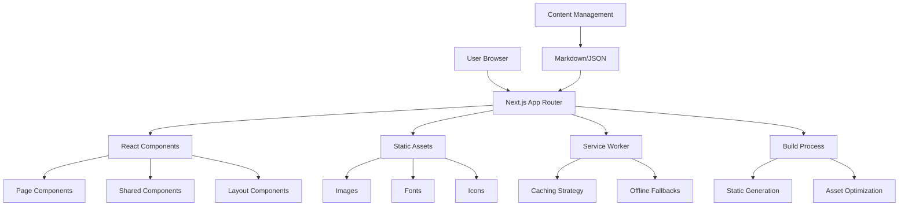

# Design Document

## Overview

This design document outlines the architecture and implementation approach for migrating numeralhq.com from Webflow to a Next.js Progressive Web App (PWA). The migration will leverage Next.js 15 with the App Router, modern React patterns, and PWA capabilities to deliver improved performance, offline functionality, and maintainability while preserving the existing design and user experience.

## Architecture

### High-Level Architecture



### Technology Stack

- **Framework**: Next.js 15 with App Router
- **Language**: TypeScript for type safety
- **Styling**: Tailwind CSS for utility-first styling
- **PWA**: next-pwa for service worker and PWA capabilities
- **Image Optimization**: Next.js built-in Image component
- **Content Management**: File-based content (Markdown/JSON) or headless CMS integration
- **Deployment**: Vercel or similar platform with automatic deployments
- **Testing**: Jest and React Testing Library

## Components and Interfaces

### Core Components Structure

```
src/
├── app/                    # App Router pages and layouts
│   ├── layout.tsx         # Root layout
│   ├── page.tsx           # Homepage
│   ├── globals.css        # Global styles
│   └── [slug]/            # Dynamic pages
├── components/            # Reusable components
│   ├── ui/               # Basic UI components
│   ├── layout/           # Layout components
│   ├── sections/         # Page sections
│   └── forms/            # Form components
├── lib/                  # Utilities and configurations
├── content/              # Content files (if file-based)
├── public/               # Static assets
│   ├── icons/            # PWA icons
│   ├── images/           # Optimized images
│   └── manifest.json     # PWA manifest
└── styles/               # Additional styles
```

### Key Component Interfaces

#### Layout Components
- **Header**: Navigation, logo, mobile menu
- **Footer**: Links, contact information, social media
- **Layout**: Wrapper component with consistent spacing and structure

#### Content Components
- **Hero**: Main banner sections with call-to-action
- **ContentBlock**: Flexible content sections
- **ImageGallery**: Optimized image displays
- **ContactForm**: Contact and inquiry forms

#### PWA Components
- **InstallPrompt**: PWA installation prompt
- **OfflineIndicator**: Network status indicator
- **UpdateNotification**: App update notifications

## Data Models

### Content Structure

```typescript
interface PageContent {
  slug: string;
  title: string;
  description: string;
  seoTitle?: string;
  seoDescription?: string;
  openGraphImage?: string;
  sections: ContentSection[];
}

interface ContentSection {
  id: string;
  type: 'hero' | 'content' | 'gallery' | 'contact' | 'custom';
  data: Record<string, any>;
  styling?: SectionStyling;
}

interface SectionStyling {
  backgroundColor?: string;
  textColor?: string;
  padding?: string;
  margin?: string;
  customClasses?: string[];
}

interface NavigationItem {
  label: string;
  href: string;
  children?: NavigationItem[];
}

interface SiteConfig {
  title: string;
  description: string;
  url: string;
  navigation: NavigationItem[];
  footer: FooterConfig;
  pwa: PWAConfig;
}
```

### PWA Configuration

```typescript
interface PWAConfig {
  name: string;
  shortName: string;
  description: string;
  themeColor: string;
  backgroundColor: string;
  icons: PWAIcon[];
  startUrl: string;
  display: 'standalone' | 'minimal-ui' | 'fullscreen';
}

interface PWAIcon {
  src: string;
  sizes: string;
  type: string;
  purpose?: 'any' | 'maskable' | 'monochrome';
}
```

## Error Handling

### Error Boundaries
- Implement React Error Boundaries for graceful error handling
- Custom error pages for 404, 500, and other HTTP errors
- Fallback UI components for failed content loading

### Network Error Handling
- Service worker intercepts failed network requests
- Offline fallback pages for uncached content
- Retry mechanisms for failed API calls
- User-friendly error messages with recovery options

### Content Loading Errors
- Graceful degradation for missing images or content
- Skeleton loading states during content fetch
- Alternative content display when primary content fails

## Testing Strategy

### Unit Testing
- Component testing with React Testing Library
- Utility function testing with Jest
- Mock external dependencies and APIs
- Test coverage targets: 80%+ for critical components

### Integration Testing
- Page-level testing with full component trees
- Navigation flow testing
- Form submission and validation testing
- PWA functionality testing

### End-to-End Testing
- Critical user journey testing with Playwright or Cypress
- Cross-browser compatibility testing
- Mobile responsiveness testing
- PWA installation and offline functionality testing

### Performance Testing
- Core Web Vitals monitoring
- Lighthouse CI integration
- Bundle size analysis
- Image optimization verification

## PWA Implementation Details

### Service Worker Strategy
- **Caching Strategy**: Stale-while-revalidate for pages, cache-first for assets
- **Offline Support**: Cache critical pages and assets for offline access
- **Update Mechanism**: Background updates with user notification
- **Cache Management**: Automatic cleanup of old cache versions

### Manifest Configuration
- App icons in multiple sizes (192x192, 512x512, maskable)
- Standalone display mode for app-like experience
- Theme colors matching brand identity
- Start URL configuration for optimal launch experience

### Installation Prompts
- Custom install prompt with brand-appropriate messaging
- Install button in header or footer
- Deferred prompt handling for optimal timing
- Analytics tracking for installation events

## Migration Strategy

### Content Migration Process
1. **Content Audit**: Catalog all existing Webflow pages and content
2. **Asset Extraction**: Download and optimize all images, fonts, and media
3. **Structure Mapping**: Map Webflow sections to Next.js components
4. **Style Recreation**: Recreate Webflow styles using Tailwind CSS
5. **Content Integration**: Implement content management approach

### Deployment Strategy
1. **Staging Environment**: Deploy to staging for testing and review
2. **Performance Validation**: Verify performance improvements
3. **SEO Verification**: Ensure SEO elements are properly implemented
4. **User Acceptance Testing**: Validate functionality matches requirements
5. **Production Deployment**: Deploy with proper redirects and monitoring

### Rollback Plan
- Maintain Webflow site during migration period
- DNS switching capability for quick rollback
- Database backups and version control for code
- Monitoring and alerting for post-deployment issues